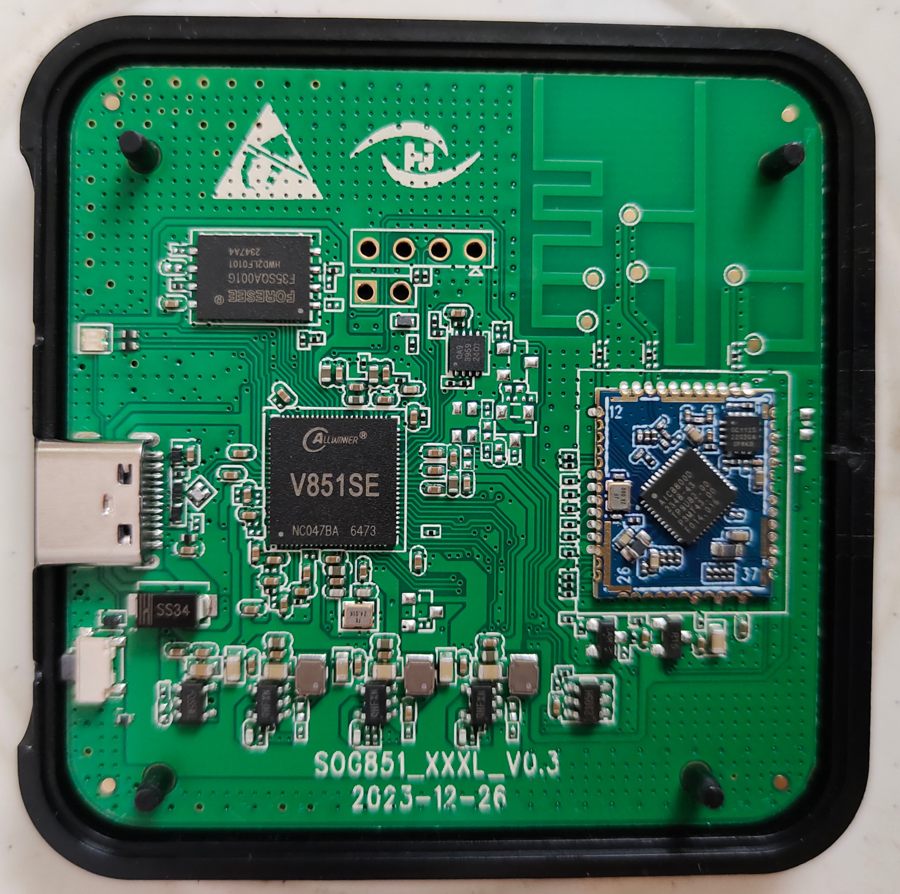

# Bootloader log
```
[24]HELLO! BOOT0 is starting!
[27]BOOT0 commit : 5841e68a26
[120][pmu]: bus read error
[122]set pll start
[124]periph0 has been enabled
[127]set pll end
[129]board init ok
[131]DRAM use internal ZQ!!
[133]ZQ value = 0x2f
[135]chip id check OK
[137]POWER SETTING ERROR!
[140]DRAM BOOT DRIVE INFO: V0.16
[143]DRAM CLK = 528 MHz
[145]DRAM Type = 2 (2:DDR2,3:DDR3)
[149]DRAMC read ODT  off.
[151]DRAM ODT off.
[154]DRAM SIZE =64 M
[156]dram_tpr4:0x0
[162]DRAM simple test OK.
[165]rtc standby flag is 0x0, super standby flag is 0x0
[170]dram size =64
[173]audio:avcc calibration
[175]spinand UBOOT_START_BLK_NUM 8 UBOOT_LAST_BLK_NUM 32
[181]block from 8 to 32
[514]Check is correct.
[516]Entry_name        = optee
[519]Entry_name        = u-boot
[527]Entry_name        = dtb
[530]Jump to second Boot.
M/TC: OP-TEE version: 15ee1539b (gcc version 5.3.1 20160412 (Linaro GCC 5.3-2016.05)) #1 Tue Mar 29 06:48:41 UTC 2022 arm
E/TC:0 0 platform_standby_fdt_parse:133 no pmu node
E/TC:0 0 sunxi_twi_parse_from_dt:121 no pmu node


U-Boot 2018.07 (Jan 12 2024 - 03:37:35 +0000) Allwinner Technology

[00.608]CPU:   Allwinner Family
[00.611]Model: sun8iw21
[00.613]DRAM:  64 MiB
[00.616]Relocation Offset is: 00eef000
[00.645]secure enable bit: 0
E/TC:0   tee_read_fdt:433 fine node /firmware/optee failed with FDT_ERR_NOTFOUND
[00.660]smc_tee_inform_fdt failed with: ffff0000
[00.666]CPU=900 MHz,PLL6=600 Mhz,AHB=200 Mhz, APB1=24Mhz  MBus=300Mhz
[00.672]gic: sec monitor mode
sunxi flash map init
SPI ALL:   ready
[00.679]line:724 init_clocks
[00.682]flash init start
[00.684]workmode = 0,storage type = 0
[00.692]sunxi-spinand-phy: spinand sample_mode:1 sample_delay:19

device nand0 <nand>, # parts = 4
 #: name                size            offset          mask_flags
 0: boot0               0x00100000      0x00000000      1
 1: uboot               0x00300000      0x00100000      1
 2: secure_storage      0x00100000      0x00400000      1
 3: sys                 0x07b00000      0x00500000      0

active partition: nand0,0 - (boot0) 0x00100000 @ 0x00000000

defaults:
mtdids  : nand0=nand
mtdparts: mtdparts=nand:1024k@0(boot0)ro,3072k@1048576(uboot)ro,1024k@4194304(secure_storage)ro,-(sys)
[00.811]ubi0: attaching mtd4
[01.040]ubi0: scanning is finished
[01.049]ubi0: attached mtd4 (name "sys", size 123 MiB)
[01.054]ubi0: PEB size: 262144 bytes (256 KiB), LEB size: 258048 bytes
[01.060]ubi0: min./max. I/O unit sizes: 4096/4096, sub-page size 2048
[01.066]ubi0: VID header offset: 2048 (aligned 2048), data offset: 4096
[01.073]ubi0: good PEBs: 492, bad PEBs: 0, corrupted PEBs: 0
[01.078]ubi0: user volume: 9, internal volumes: 1, max. volumes count: 128
[01.085]ubi0: max/mean erase counter: 51/25, WL threshold: 4096, image sequence number: 0
[01.092]ubi0: available PEBs: 0, total reserved PEBs: 492, PEBs reserved for bad PEB handling: 20
[01.101]sunxi flash init ok
try green_led_gpio config
[01.316]Loading Environment from SUNXI_FLASH... OK
[01.355]Item0 (Map) magic is bad
[01.358]out of usb burn from boot: not need burn key
[01.386]update bootcmd
[01.412]change working_fdt 0x41eaee70 to 0x41e8ee70
[01.423]## error: update_fdt_dram_para : FDT_ERR_NOTFOUND
[01.428]update dts
Hit any key to stop autoboot:  0 
input addr exceed dram scope
[02.905]no vendor_boot partition is found
Android's image name: v851se-perf1
[02.999]Starting kernel ...
```

# Printenv
```
aw-ubi-spinand.ubootblks=24
boot_fastboot=fastboot
boot_from_partion=boot
boot_normal=sunxi_flash read 44800000 ${boot_partition};bootm 44800000
boot_partition=boot
boot_recovery=sunxi_flash read 44800000 extend;bootm 44800000
bootargs=ubi.mtd=sys ubi.block=0,rootfs earlyprintk=sunxi-uart,0x02500000 clk_ignore_unused initcall_debug=0 console=ttyS0,115200 loglevel=4 root=/dev/ubiblock0_5 rootfstype=squashfs init=/pseudo_init partitions=mbr@ubi0_0:boot-res@ubi0_1:env@ubi0_2:env-redund@ubi0_3:boot@ubi0_4:rootfs@ubi0_5:rootfs_data@ubi0_6:recovery@ubi0_7:UDISK@ubi0_8: cma= snum= mac_addr= wifi_mac= bt_mac= specialstr= gpt=1
bootcmd=run setargs_nand_ubi boot_normal
bootdelay=1
coherent_pool=32K
console=ttyS0,115200
earlyprintk=sunxi-uart,0x02500000
fastboot_key_value_max=0x8
fastboot_key_value_min=0x2
fdtcontroladdr=41eaee70
filesize=10000
force_normal_boot=1
init=/pseudo_init
initcall_debug=0
loglevel=4
mmc_root=/dev/mmcblk0p4
mtd_name=sys
mtdids=nand0=nand
mtdparts=mtdparts=nand:1024k@0(boot0)ro,3072k@1048576(uboot)ro,1024k@4194304(secure_storage)ro,-(sys)
nand_root=/dev/ubiblock0_5
nor_root=/dev/mtdblock3
partition=nand0,0
partitions=mbr@ubi0_0:boot-res@ubi0_1:env@ubi0_2:env-redund@ubi0_3:boot@ubi0_4:rootfs@ubi0_5:rootfs_data@ubi0_6:recovery@ubi0_7:UDISK@ubi0_8:
rdinit=/rdinit
recovery_key_value_max=0x13
recovery_key_value_min=0x10
root_partition=rootfs
rootfstype=squashfs
rotpk_status=0
setargs_mmc=setenv  bootargs earlyprintk=${earlyprintk} clk_ignore_unused initcall_debug=${initcall_debug} console=${console} loglevel=${loglevel} root=${mmc_root}  rootwait init=${init} partitions=${partitions} cma=${cma} mac_addr=${mac} wifi_mac=${wifi_mac} bt_mac=${bt_mac} selinux=${selinux} specialstr=${specialstr} coherent_pool=${coherent_pool} ion_carveout_list=${reserve_list}
setargs_nand=setenv bootargs earlyprintk=${earlyprintk} clk_ignore_unused initcall_debug=${initcall_debug} console=${console} loglevel=${loglevel}  ubi.mtd=${mtd_name} root=${nand_root} rootfstype=${rootfstype} rootwait init=${init} rdinit=${rdinit} partitions=${partitions} cma=${cma} mac_addr=${mac} wifi_mac=${wifi_mac} bt_mac=${bt_mac} selinux=${selinux} specialstr=${specialstr} coherent_pool=${coherent_pool} ion_carveout_list=${reserve_list}
setargs_nand_ubi=setenv bootargs ubi.mtd=${mtd_name} ubi.block=0,${root_partition} earlyprintk=${earlyprintk} clk_ignore_unused initcall_debug=${initcall_debug} console=${console} loglevel=${loglevel} root=${nand_root} rootfstype=${rootfstype} init=${init} partitions=${partitions} cma=${cma} snum=${snum} mac_addr=${mac} wifi_mac=${wifi_mac} bt_mac=${bt_mac} specialstr=${specialstr} gpt=1
setargs_nor=setenv bootargs  earlyprintk=${earlyprintk} clk_ignore_unused initcall_debug=${initcall_debug} console=${console} loglevel=${loglevel} root=${nor_root} rootwait init=${init} rdinit=${rdinit} partitions=${partitions} cma=${cma} coherent_pool=${coherent_pool} ion_carveout_list=${reserve_list}
ubi_attach_mtdnum=3
verify=N

Environment size: 3048/131067 bytes
```

# UBI Info
```
=> ubi info
UBI: MTD device name:            "sys"
UBI: MTD device size:            123 MiB
UBI: physical eraseblock size:   262144 bytes (256 KiB)
UBI: logical eraseblock size:    258048 bytes
UBI: number of good PEBs:        492
UBI: number of bad PEBs:         0
UBI: smallest flash I/O unit:    4096
UBI: VID header offset:          2048 (aligned 2048)
UBI: data offset:                4096
UBI: max. allowed volumes:       128
UBI: wear-leveling threshold:    4096
UBI: number of internal volumes: 1
UBI: number of user volumes:     9
UBI: available PEBs:             0
UBI: total number of reserved PEBs: 492
UBI: number of PEBs reserved for bad PEB handling: 20
UBI: max/mean erase counter: 52/26
=> ubi info l
Volume information dump:
	vol_id          0
	reserved_pebs   17
	alignment       1
	data_pad        0
	vol_type        4
	name_len        3
	usable_leb_size 258048
	used_ebs        17
	used_bytes      4194304
	last_eb_bytes   65536
	corrupted       0
	upd_marker      0
	name            mbr
Volume information dump:
	vol_id          1
	reserved_pebs   3
	alignment       1
	data_pad        0
	vol_type        3
	name_len        8
	usable_leb_size 258048
	used_ebs        3
	used_bytes      774144
	last_eb_bytes   258048
	corrupted       0
	upd_marker      0
	name            boot-res
Volume information dump:
	vol_id          2
	reserved_pebs   2
	alignment       1
	data_pad        0
	vol_type        3
	name_len        3
	usable_leb_size 258048
	used_ebs        2
	used_bytes      516096
	last_eb_bytes   258048
	corrupted       0
	upd_marker      0
	name            env
Volume information dump:
	vol_id          3
	reserved_pebs   2
	alignment       1
	data_pad        0
	vol_type        3
	name_len        10
	usable_leb_size 258048
	used_ebs        2
	used_bytes      516096
	last_eb_bytes   258048
	corrupted       0
	upd_marker      0
	name            env-redund
Volume information dump:
	vol_id          4
	reserved_pebs   25
	alignment       1
	data_pad        0
	vol_type        3
	name_len        4
	usable_leb_size 258048
	used_ebs        25
	used_bytes      6451200
	last_eb_bytes   258048
	corrupted       0
	upd_marker      0
	name            boot
Volume information dump:
	vol_id          5
	reserved_pebs   61
	alignment       1
	data_pad        0
	vol_type        3
	name_len        6
	usable_leb_size 258048
	used_ebs        61
	used_bytes      15740928
	last_eb_bytes   258048
	corrupted       0
	upd_marker      0
	name            rootfs
Volume information dump:
	vol_id          6
	reserved_pebs   102
	alignment       1
	data_pad        0
	vol_type        3
	name_len        11
	usable_leb_size 258048
	used_ebs        102
	used_bytes      26320896
	last_eb_bytes   258048
	corrupted       0
	upd_marker      0
	name            rootfs_data
Volume information dump:
	vol_id          7
	reserved_pebs   34
	alignment       1
	data_pad        0
	vol_type        3
	name_len        8
	usable_leb_size 258048
	used_ebs        34
	used_bytes      8773632
	last_eb_bytes   258048
	corrupted       0
	upd_marker      0
	name            recovery
Volume information dump:
	vol_id          8
	reserved_pebs   222
	alignment       1
	data_pad        0
	vol_type        3
	name_len        5
	usable_leb_size 258048
	used_ebs        222
	used_bytes      57286656
	last_eb_bytes   258048
	corrupted       0
	upd_marker      0
	name            UDISK
Volume information dump:
	vol_id          2147479551
	reserved_pebs   2
	alignment       1
	data_pad        0
	vol_type        3
	name_len        13
	usable_leb_size 258048
	used_ebs        2
	used_bytes      516096
	last_eb_bytes   2
	corrupted       0
	upd_marker      0
	name            layout volume
```


